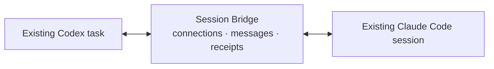

# Session Bridge

[](https://github.com/ItamarRocha/session-bridge/actions/workflows/ci.yml)

**Connect your running Codex and Claude Code sessions.**

Ask Claude to review a commit while Codex keeps building. Delegate a benchmark to another session. Share a result without copying it between terminals. Each session keeps its own conversation, tools, and permissions.



Sessions connect by their native IDs. Each can talk to multiple peers, publish a short “working on” status, and exchange requests, updates, and replies. The bridge uses Codex's native queue and Claude's native Monitor; small local helpers carry messages between the existing model sessions.

**v0.3.0 · experimental · local macOS sessions under one OS account.** A live Claude → Codex → Claude roundtrip is verified. Native busy-session and restart trials remain open; see [validation](docs/validation.md).

## Quick start

You need **Node.js 24+**, npm, a Codex client with `codex queue`, and interactive Claude Code with the native `Monitor` tool. Availability depends on the client and configuration; see [requirements](docs/getting-started.md#requirements).

### 1. Build the bridge

Keep the checkout in a permanent location: the plugin runs its built files directly.

```bash
git clone https://github.com/ItamarRocha/session-bridge.git
cd session-bridge
npm ci
npm run build
node dist/cli.js doctor
```

### 2. Load it into Claude

From that checkout, register a [personal directory plugin](https://code.claude.com/docs/en/plugins-reference#skills-directory-plugins):

```bash
bridge_project="$PWD"
bridge_plugin="$HOME/.claude/skills/session-bridge"
if [ -e "$bridge_plugin" ] || [ -L "$bridge_plugin" ]; then
  printf 'Inspect the existing plugin path before continuing: %s\n' "$bridge_plugin"
else
  mkdir -p "$HOME/.claude/skills"
  ln -s "$bridge_project" "$bridge_plugin"
fi
```

If the destination already exists, inspect it before replacing it. In your existing Claude conversation, run:

```text
/reload-plugins
```

Loading the plugin makes the commands available. Receiver activation is explicit.

### 3. Connect and send

Ask your existing Codex task for its native ID—it comes from `CODEX_THREAD_ID` in that task's shell. Then, in Claude:

```text
/session-bridge:connect codex:YOUR_CODEX_TASK_UUID
```

Ask Claude:

> Send the connected Codex task a connectivity test and ask it to reply “pong from Codex.”

The first message notifies that Codex task; reading it binds the connection. A reciprocal connect is unnecessary. To see your peers and their status:

```text
/session-bridge:sessions
```

For the Codex-first flow, client resume, optional MCP setup, shared data directories, or profile routing, follow the [setup guide](docs/getting-started.md). Existing users should read the [v0.3 upgrade steps](docs/support.md#upgrading-to-v030) before opening an older ledger.

## Six methods

| Method | Purpose |
| --- | --- |
| `bridge_connect` | Connect to one selected native session ID. |
| `bridge_sessions_list` | See connected peers, receiver availability, and reported work. |
| `bridge_status_update` | Publish your own short “working on” line. |
| `bridge_message_send` | Send a bounded request, informational update, or reply. |
| `bridge_messages_read` | Read incoming messages or inspect an exchange. |
| `bridge_disconnect` | Disconnect one peer while keeping your other connections. |

Goals, handoffs, and reviews stay in the agents' native task state and conversation. The [shared skill](skills/session-bridge/SKILL.md) explains how to delegate, review, and continue independent work with these methods. See the [method reference](docs/methods.md) for arguments and return values.

## What delivery means

```text
Claude inbox:  queued → notified → read → replied
Codex queue:   submitted → read → replied
```

A notification records submission of a message reference to the native stream or queue. A read records that the agent fetched it. A reply is the request's substantive result. None of these grants additional tool permissions.

Messages and connections survive a Claude receiver restart. Explicit reactivation in the same native conversation resumes eligible unread delivery; duplicate protection preserves the original exchange. A saved connection, receiver availability, and self-reported work status are separate facts.

The bridge stores selected message text locally. Content may be processed by the receiving model provider. It works between sessions sharing one local ledger; cloud routing and automatic cross-agent permission approval are outside this version.

## Documentation

| Guide | Read it for |
| --- | --- |
| [Getting started](docs/getting-started.md) | Installation, both connection directions, and configuration. |
| [Method reference](docs/methods.md) | The six tools, identity, message limits, and receipts. |
| [Collaboration](docs/collaboration.md) | Delegation, handoffs, and review examples. |
| [Architecture](docs/architecture.md) | The ledger, receiver lifecycle, and native adapters. |
| [Troubleshooting](docs/support.md) | Receiver recovery, profile routing, and upgrades. |
| [Validation](docs/validation.md) | What automated checks and native trials establish. |
| [Contributing](CONTRIBUTING.md) | Repository layout and development checks. |

A [visual collaboration guide](docs/collaboration.html) is also included; open the local HTML file in a browser after cloning.

## License

The repository is currently `UNLICENSED`; a public-release license has not been selected. Source builds are supported; the package is not published to npm.
