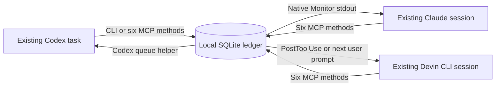

# Architecture

## Existing conversations connected by messages

The bridge moves selected messages between existing conversations. Each session can connect to several peers, including peers of the same provider. It has no model credentials, inference client or session-spawning API. Goals, tasks and collaboration decisions remain in the clients. The bridge owns connections, durable messages and a short self-status. [Six-method interface](methods.md)

The ledger owns native session identity, connection edges, durable inboxes, receiver leases, message IDs, expiry, receipts and replies. The `Sessions` facade resolves native identities and exposes the six methods over the existing ledger and adapters. Transport notifications carry an opaque token for the recipient's inbox wakeup. The agent reads a bounded page of stored messages through that token before acting.

## Native identity and connections

Public addresses use `codex:`, `claude:` or `devin:` prefixes. Codex/Claude native UUIDs and exact, case-preserving Devin IDs resolve from local registrations when bare. An unknown bare ID requires provider clarification; only explicit `codex:UUID` can create a provisional Codex recipient. Connecting is silent. The first send can notify that Codex task, whose eligible incoming read binds it from its own native context without a reciprocal connect.

Codex supplies current identity in `_meta.threadId` per MCP call, or `CODEX_THREAD_ID` in the task's own CLI shell. Claude's hook supplies its current `session_id` per call; its explicit activation command starts a receiver using current skill substitution. A stale MCP startup environment does not identify a new Claude conversation. [Codex MCP source](https://github.com/openai/codex/blob/rust-v0.153.1/codex-rs/core/src/mcp_tool_call.rs#L506), [Claude hook input](https://code.claude.com/docs/en/hooks#common-input-fields)

Devin obtains `session_id` from native command-hook stdin. Its `PreToolUse` adapter supplies validated per-call context to the existing MCP server. A selected `bridge_connect` activates the caller and pairs it; passive hooks and listing cannot enroll it. The Devin manifest selects its own MCP and skills so Claude compatibility fallback cannot select the wrong host. [Devin hook input](https://docs.devin.ai/cli/extensibility/hooks/overview#command-hooks), [plugin precedence](https://docs.devin.ai/cli/extensibility/plugins/overview#compatible-formats)

Connection edges are explicit and non-transitive. A–B and A–C permit those pairs to exchange messages; they do not connect B–C. `bridge_sessions_list` projects only the invoking session's connected peers. `bridge_disconnect` closes one edge without closing other peers or native sessions.

## Host adapters

**Codex:** the adapter invokes `codex queue --thread <UUID> --message <notification>` with an argument array and ordinary Codex home/configuration. The owning client decides when to consume the item. Unloaded or paused tasks can leave it queued. The adapter does not start another app server or resume the target. Queue writes require access to native Codex storage, including the caller's normal sandbox permission flow when invoked from a task shell. [Published queue source](https://github.com/openai/codex/blob/rust-v0.153.1/codex-rs/ext/queue/src/service.rs)

**Claude Code:** `/session-bridge:connect` explicitly starts Claude's native `Monitor` tool with `persistent: true`, running the bridge receiver with the current native session ID. The receiver watches the durable SQLite inbox and emits a coalesced inbox notification through native monitor stdout. Per-message delivery needs no Unix socket or live sender-to-receiver connection. The normal six-method workflow needs no private ticket exchange. Opening a terminal or listing sessions does not start a monitor. [Monitor tool](https://code.claude.com/docs/en/tools-reference#monitor-tool), [skill substitutions](https://code.claude.com/docs/en/skills#available-string-substitutions)

A Claude native identity and its history/connections survive receiver exit. A five-second ownership lease, renewed every second, permits one watcher for that identity; release or expiry lets an explicitly started replacement take over without reconnecting peers. This is transport ownership, not a work assignment or model scheduler.

**Devin CLI:** `PostToolUse` and `UserPromptSubmit` hooks check the existing ledger after explicit connection. An eligible inbox produces at most one coalesced opaque notification through `additionalContext`; message text stays in the ledger until the MCP read records receipt. With no existing ledger or activation, the inbox hook exits silently without creating a bridge directory. No persistent model/monitor process, SessionStart enrollment or Stop hook is installed. An already-idle Devin waits for a later lifecycle boundary or explicit read. [Devin lifecycle hooks](https://docs.devin.ai/cli/extensibility/hooks/lifecycle-hooks)

The helpers share the ledger without a central coordination daemon. MCP stdout is protocol-only; monitor stdout carries notifications; diagnostics use stderr. Native model consumption and wake timing require [live validation](validation.md).

## Scope and authority

A connection permits messages between selected sessions. It does not grant broader execution, publication, spending or native permission authority. Each request states enough scope for the receiver to evaluate it against the user's task. Status is a self-published one-liner with an update timestamp. A separate receiver projection reports `state`, `checkedAt`, `expiresAt`, `transport` and `idleWakeAvailable`; a connected peer can have an unavailable receiver. Codex native-queue receiver availability remains unknown when the bridge cannot observe its owner. Devin reports `transport: "hooks"`, unknown availability and `idleWakeAvailable: false`; Codex and Claude adapters report that capability as true. Neither projection proves model activity or receipt.

The shared skill supplies delegation, handoff acceptance, snapshot-bound review and continuation instructions. Native goals or conversation state retain the plan and pending dependencies. There is no bridge goal table, work engine, review subscription, scheduler or cross-agent permission supervisor.

The CLI is a local operator interface. Processes with access to this OS account and bridge files already have that authority; native context guards accidental session mix-ups, not mutually untrusted processes under the same account.

## Message lifecycle

Message receipt and notification submission have separate records. New messages retain `deliveryStage: "queued"` while a shared notification is pending or submitted. An actual agent read sets `acknowledgedAt` and stage `read`; one substantive result sets `answeredBy` and stage `replied`. Existing legacy delivery fields retain their historical meaning.

Notification state is `pending`, `submitting`, `submitted` or `unknown`. Session-list `inbox` and send's `recipientInbox` expose that state with `createdAt`, `detail` and `nativeQueueId`, plus `unreadCount` and `pendingRequestCount`. The latter includes already-read unanswered requests. Status omits the opaque token, so proactive polling cannot consume a still-queued native wakeup.

Each native recipient has one outstanding inbox notification per bridge directory. New messages remain durable and share that wakeup instead of each enqueueing a native prompt. The notification token is opaque and belongs to the delivered wakeup. Receiver ownership leases and notification state are separate. Restarting can resume a never-started pending notification; an already submitting, submitted or unknown notification remains outstanding without re-emission. This changes v0.3 restart replay into conservative recovery through visible state and ordinary inbox reads.

Only a read carrying that notification token consumes the wakeup. It records receipts for at most one bounded page (default 20, maximum 100), reports consumed/replayed/remaining evidence and rearms delivery when unread messages remain. A replay returns prior reads as non-actionable; targeted/history reads retain explicit unfinished-request recovery. Ordinary reads, unread polling and status/listing do not consume pending notification state. A late native wakeup can therefore produce an empty result if its messages were read independently; that is not a new assignment or a reason to send an acknowledgment.

The Codex queue API adds notifications but cannot retract a queued item. One outstanding wakeup may survive after its messages become ineligible, and pre-upgrade backlog cannot be recalled. Use one permanent bridge home for normal work: separate homes have independent recipient notification state.

Sends and replies persist before notification reservation/dispatch. A crash between those steps can leave unread work with no token. An identical idempotent send can resume dispatch; explicit reads can recover stored work, and an active Claude watcher can reserve on its next poll.

Idempotency keys deduplicate message creation. They cannot make external actions exactly-once. Unknown/dispatching outcomes and old submitted notifications are preserved during migration rather than automatically replayed. Inspect prior messages, receipts and native delivery evidence before recovery. The v0.5.0 ledger uses schema 5 to add Devin identities to the notification ledger; stop every older helper before opening the upgraded ledger.

Receipt tokens remain internal. Repeated reads return the existing receipt and never allocate a replacement claim. The retired 30-minute `claimExpiresAt` remains only as internal schema-compatibility data; the six-method interface does not expose it. The original request stays authoritative: one late result remains eligible until its expiry, normally one hour from creation, or cancellation/disconnection. Inspecting prior work is required before continuing after a restart. Incoming history includes read and blocked entries; an authorized sent-message inspection is read-only.

Cancellation, expiry and explicit disconnection fence new claims and replies. Receiver exit alone preserves the relationship and inbox. Neither operation can undo external actions or retract an already emitted native notice.

Only a request accepts one substantive reply. Notices and replies are terminal. An informational handoff acceptance leaves the final result available; receipts and terminal replies do not create automatic acknowledgment loops.

## Data and extension boundaries

The ledger stores selected message bodies and metadata locally. It does not scan transcripts, synchronize native task databases, read provider credentials or use proprietary client inbox protocols. Message text can still disclose selected content to the receiving model provider.

New delivery adapters must preserve explicit identity, connection checks and submission uncertainty. Remote relays and actual cloud-session routing are outside this local version. A native ID is an address within the configured local bridge, not a network route.

The default catalog has six methods; `--legacy-tools` selects the old catalog only for compatibility with the previous interface. Legacy CLI operations retain diagnostics, exceptional cancellation and full receiver shutdown. [Operator recovery](support.md#operator-recovery)
