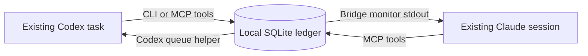

# Design

## One conversation at each end

The bridge moves selected messages between the existing owners of two conversations. It has no model credentials, inference client, or session-spawning API. A peer is a bridge identity for one attached conversation; it is not a replacement conversation.

The ledger is the authority for peer registration, pairings, request IDs, expiry, claims, and replies. Delivery adapters carry a reference to a stored message. The receiving agent fetches and claims that record before acting, keeping a transport notification distinct from accepted work.

## Host adapters

**Codex:** the bridge invokes the public `codex queue --thread <UUID> --message <notification>` command with an argument array. It uses the exact task ID and the ordinary Codex home/configuration. The owning client decides when to consume the queued item. It can remain queued when the task is unloaded or paused. The bridge does not start another app server or resume the target. The interface is present in the published [Codex v0.153.1 queue implementation](https://github.com/openai/codex/blob/rust-v0.153.1/codex-rs/tui/src/session_queue_commands.rs).

**Claude Code:** a plugin-owned monitor is a small bridge process. It exposes a local bridge endpoint and emits message references as stdout notifications to its owning Claude session. Its initial notification contains a single-use attachment ticket. The MCP connection redeems that ticket before it can act as the peer. This uses the documented [plugin monitor contract](https://code.claude.com/docs/en/plugins-reference#monitors), without decoding Claude's proprietary native inbox protocol.

The helpers do not coordinate through a central daemon. They share the ledger, and the Claude monitor owns its receiver endpoint. MCP stdout is reserved for MCP; monitor stdout is reserved for notifications. Diagnostic output goes to stderr.

## Pairing and authority

A user instructs a session to attach and pair with a specific shareable peer ID. Attachment tickets bind a Claude MCP connection to its own monitor and are separate from public peer IDs. A Codex attachment uses the caller's exact task UUID. Caller identity stays bound to the MCP connection once attached.

Pairing permits messages between those peers. It does not elevate a peer's request above the receiving user's instructions or grant blanket authority to edit, publish, spend, or contact people. Scope each request so the receiver can determine the authorized action. Both ends retain their normal client permissions.

The CLI is a local operator interface: `--self` selects an existing peer. Anyone with access to this OS account and the bridge files already has this authority. The initial design does not isolate mutually untrusted sessions running as the same user.

## Message lifecycle

Delivery and work acceptance are separate facts:

| Field or state | Meaning |
| --- | --- |
| `stored` | The ledger has the message; submission has not completed. |
| `dispatching` | An adapter attempt has started. |
| `submitted` | The adapter reports that it handed off the notification. |
| `unknown` | An attempt may have reached the destination; inspect before retrying. |
| `acknowledgedAt` / `claimId` | The destination claimed the ledger message. |
| `answeredBy` | A single recorded reply answers the request. |
| `cancelledAt` / `expiresAt` | The request is no longer eligible for new work. |

A request's idempotency key deduplicates local creation. It cannot make a native client queue exactly-once. An adapter crash after native submission can leave an uncertain result, so the bridge does not retry uncertain deliveries automatically.

Concurrent claims return the same receipt; repeat calls include `alreadyClaimed: true` so the agent can inspect prior progress before continuing. This cannot guarantee exactly-once external actions. The default claim lease is 30 minutes, capped by message expiry. An expired claim cannot be reclaimed automatically. Inspect abandoned work explicitly and send a new authorized request if recovery is needed. Cancellation, expiry, and disconnection are checked when work is claimed or replied to; they cannot retract a native notification or undo an external action.

Only a `request` can receive one substantive `reply`. Acknowledgments update the ledger without waking the sender. `notice` and `reply` are terminal. This bounds a normal exchange without relying on agents to stop an endless acknowledgment loop.

## Data and distribution

The project stores message bodies and metadata locally. It does not read full transcripts, credentials, or provider account tokens. A message body can itself disclose selected project content when the destination model processes it; callers choose what to send.

Client binaries remain unmodified. Integration choices rely on official documentation and published Codex source under its applicable license. The bridge's design is not a legal guarantee for every account, organization, or future product use. Reassess the applicable agreements before offering a hosted service or handling other users' accounts.

## Extension boundaries

Add another host through a delivery adapter with an explicit success/uncertainty result. Preserve the ledger's distinction between transport submission, claim, and completed reply. Keep identity, pairing checks, and message transitions in the ledger rather than reproducing them in each adapter.

Potential later work includes verified live-session compatibility records, a human pairing/status UI, opt-in delivery reconciliation, and richer artifact references. Remote relays, autonomous multi-hop delegation, transcript replication, and proprietary client IPC are outside this implementation.
