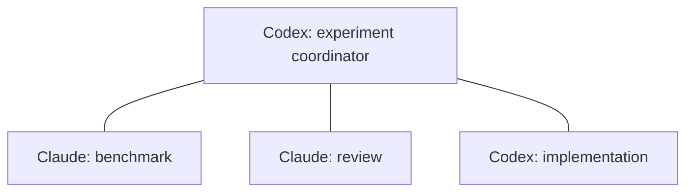

# Multiple sessions and a clear plugin interface

Design extension · 2026-09-05 · [Collaboration plan](collaboration-v2.md) · [Visual document](collaboration-v2.html#network)

**Recommendation:** support a graph of existing sessions, with explicit connections and independent shared goals. Make listing connections and inspecting a session the obvious first two operations. Keep session connectivity, observed activity, delivery, and work progress separate in every response.

**Current versus proposed:** the existing ledger already permits multiple simultaneous pairings, including Codex–Codex and Claude–Claude. This was checked with four temporary peers and eight bidirectional request/reply exchanges against the current Store. Disconnecting one pair preserved the other pairs. No live models or native transport were involved in that check. The method names and richer response contracts below are proposed; this revision adds documentation, not new registered MCP tools.

## 1. Sessions form a graph; goals organize work

One Codex can coordinate two Claudes and another Codex. A Claude can coordinate several Codex sessions. The provider determines delivery, not whether it may coordinate or review.

Those three connections do not create a connection between the workers. A–B and A–C do not authorize B–C, transcript sharing, or access to each other's unrelated work. A user can authorize a named team in one action; the bridge records the exact members and permitted communication. It need not ask the user to repeat a pairing ceremony for every authorized edge.

A connection describes who may exchange scoped messages. A goal describes the outcome, coordinator, participants, roles, acceptance authority, and dependencies. The same session can participate in several goals and hold different roles in each. Completing one goal closes only its obligations and subscriptions, not the session's other connections or goals.

One session should not receive overlapping new execution assignments merely because it has many connections. Initially schedule one work turn at a time per native conversation, while separately tracking already-running external operations. Queues need fairness across goals, bounded outstanding assignments, and backpressure. A sender can continue independent work while a destination is busy. A time-sensitive permission request cannot assume the native queue can interrupt that busy session.

## 2. The default list means “connected to me”

`bridge_sessions_list()` returns this caller's connected peers, without waking them. It does not return every process on the machine. Optional filters include provider, goal, connection state, attention needed, and pagination. Pending invitations can be included explicitly; they are never labelled connected.

`bridge_sessions_discover()` is a separate read-only operation for finding possible targets through supported local discovery. Results include evidence source, observation time, and coverage limits. Discovery does not activate a receiver, create a pairing, grant permission, or collect transcripts. An omitted session might simply be undiscoverable.

`bridge_session_get(sessionId)` returns a detailed, scope-filtered view of a selected session. Omit the ID for self. An unattached caller gets an explicit inactive/self result or an activation-required error where appropriate; read operations never attach implicitly.

Example presentation, using fictional labels rather than a live session inventory:

| Session | Provider | Connection | Activity observation | Shared work | Attention |
| --- | --- | --- | --- | --- | --- |
| Benchmark | Claude | Connected | Working, recently reported | Running benchmark; result event due | None |
| Review | Claude | Connected | Waiting for permission, hook evidence | Review blocked on a tool | Approval pending |
| Implementation | Codex | Connected | Unknown; previous observation stale | Implementation item assigned | Awaiting acknowledgement |

The bridge must not turn the third row into “offline” just because an acknowledgement is missing.

### Session summary contract

| Field | Meaning |
| --- | --- |
| `sessionId`, `provider`, `label`, `device` | Native identity and human-readable address; machine disambiguation when necessary. |
| `connection` | Relationship to the caller: invited, connected, or closed; an independent pause flag; granted scope and expiry summary. |
| `activity` | Working, idle, waiting for input/permission, or unknown, with source, observation time and staleness. Agent self-reports remain attributed as reports. |
| `reachability` | Available, unavailable, activation required, or unknown, backed by a separate observation. |
| `sharedWork` | Only caller-visible goals, role, work item, next action, checkpoint, blocker and scheduled continuation. |
| `delivery` | Pending counts and oldest pending age for the caller's exchanges; uncertain submissions remain distinct from acknowledged requests. |
| `capabilities` | Whether this recipient can accept native delivery, bootstrap, participate in review, or expose a permission hook; distinguish unsupported from unknown. Capability support and the caller's authorization are separate fields. |
| `attention` | Structured reasons such as approval pending, missed checkpoint, unknown delivery, or activation required. |

List responses are bounded summaries. Details and authorized message bodies are fetched separately. Never return attachment tickets, socket authentication, account tokens, or unrelated goal content in a status row. Current same-user storage is not hostile-process isolation; these visibility rules constrain normal plugin access.

## 3. Core MCP methods

Use consistent names: a clear noun and action, stable argument names, and distinct read versus mutation operations. Avoid one universal method with dozens of unrelated actions, or a `status` method whose meaning changes according to arbitrary optional IDs.

| Proposed method | Main input | Result and side effect |
| --- | --- | --- |
| `bridge_sessions_list` | Provider/goal/connection filters; `limit`, `cursor` | Connected-to-caller summaries by default. Read only. |
| `bridge_session_get` | Optional `sessionId` (self by default) | Detailed authorized session/connection/work status. Read only. |
| `bridge_sessions_discover` | Provider/device filters; `limit`, `cursor` | Discoverable native targets and observation coverage. Read only; no enrollment. |
| `bridge_connect` | Native `sessionId`, explicit collaboration scope, `idempotencyKey` | Reuses or creates the scoped connection/invitation. Returns pending versus acknowledged status. |
| `bridge_disconnect` | `sessionId`, reason | Closes the caller's connection to that peer and records affected obligations. Other edges remain intact. |
| `bridge_inbox_list` | Goal/work/state filters; `limit`, `cursor` | Metadata for pending or claimed incoming messages. Listing neither claims work nor sends receipts. |
| `bridge_message_get` | `messageId` | Authorized body and lifecycle details. Read only. |
| `bridge_message_send` | `toSessionId`, request/notice kind, body, optional `goalId`/`workId`, `idempotencyKey`, expiry | Stores one targeted message and returns delivery evidence. No implicit broadcast. |
| `bridge_message_claim` | `messageId` | Claims an incoming message once and returns a claim token. Receipt does not claim a work item. |
| `bridge_message_reply` | `messageId`, claim token, body | One substantive reply to a request; duplicate identical replies return the original result. |
| `bridge_message_cancel` | `messageId` | Cancels a request sent by this caller and fences later receipt/reply. Cannot undo external work. |
| `bridge_detach` | Reason | Explicitly leaves the bridge from this session and closes its connections. Does not stop the native model session. |

Connecting to an already connected native ID is idempotent within the same grant scope. Requesting wider scope is a new authorization decision, not an incidental reconnect. If several grants to a peer exist, status shows them; a connection-wide disconnect revokes them together. Narrow goal participation changes act on that goal instead of disconnecting the peer.

An optional later `bridge_message_send_many` must take an explicit recipient list and return one result per recipient. A shared batch key derives a distinct recipient key; the present sender-wide idempotency key cannot be reused for different recipients. No wildcard “all sessions,” inferred recipients, invisible forwarding, or all-or-nothing success claim. Start with individual sends; a batch helper is not needed to support many peers.

## 4. Collaboration methods as their phases ship

These are semantic operations, not unrestricted setters for ledger state. Do not advertise them in the running plugin before their invariants exist. Organize documentation into these groups; do not assume every client dynamically hides or reloads tools correctly.

| Group | Proposed methods | Contract |
| --- | --- | --- |
| Goal | `bridge_goal_create`, `bridge_goals_list`, `bridge_goal_get` | Create an authorized objective with named participants, coordinator, scope and acceptance criteria; list/read only caller-visible goals. Starting invitations does not mean all participants have joined. |
| Goal control | `bridge_goal_pause`, `bridge_goal_resume`, `bridge_goal_cancel`, `bridge_goal_complete` | Distinguish interruption from completion. Complete checks accepted evidence and current reviews; it is not a forced state update. Other goals stay active. |
| Work | `bridge_work_assign`, `bridge_work_list`, `bridge_work_get`, `bridge_work_claim` | Create a bounded assignment, inspect it, and atomically accept ownership. An assignment remains the coordinator's responsibility until claimed. Claim tokens for work differ from message receipts. |
| Work progress | `bridge_work_checkpoint`, `bridge_work_submit` | Record execution evidence, blockers and next action. A yielding checkpoint atomically records its continuation or named blocker. Submission records immutable artifacts and asks for acceptance. |
| Work cancellation | `bridge_work_cancel` | Cancels a bounded item under the goal's control scope and reconciles in-flight effects. A cancelled required item needs replacement or an explicitly authorized criteria change before goal completion. |
| Work assessment | `bridge_work_accept`, `bridge_work_request_changes` | Designated authority accepts specific evidence/revision or records actionable follow-up. Unaccepted work cannot disappear. |
| Handoff | `bridge_handoff_offer`, `bridge_handoff_accept` | A typed subject selects one work item or goal coordination. Checkpoint, quiescence where required, expected ownership version and recipient readiness guard the ownership commit. Source retains responsibility until commit. |
| Review | `bridge_review_request`, `bridge_review_submit` | Create a specialized work item tied to an immutable revision; submit findings and a scoped verdict while the implementer continues independent work. No duplicate task database. |
| Ongoing review | `bridge_review_watch`, `bridge_review_unwatch` | Deferred to the live-review phase. Create or revoke a goal-scoped checkpoint subscription with named reviewer, artifact scope, relevant event/revision filters and coalescing policy. Each review remains revision-bound; unwatch reports outstanding review items separately. |
| Permissions | `bridge_permission_requests_list`, `bridge_permission_request_get`, `bridge_permission_resolve` | Only assigned supervisors see full authorized requests and can record approve-once, deny, or return-to-user decisions. Consumption by the original blocked hook is a separate observed transition. |

Keep narrow request and response schemas even where the method count grows. The everyday session/message group ships first; collaboration groups arrive with the corresponding implementation phases. Grouping helps navigation, but hiding a tool is never an authorization check.

`bridge_review_submit` records the reviewer's verdict and evidence. Whether it accepts the review work item depends on the goal's designated acceptance authority; a review verdict must not silently accept the implementation item or complete the goal.

A goal-coordination handoff transfers responsibility for integration and unassigned work, leaving existing item owners unchanged. It neither widens the recipient's grant nor silently changes the goal's designated acceptance authority. The target must already be authorized for the role. Work handoff and coordinator handoff share a commit protocol, not interchangeable identifiers.

Permission resolution returns whether a decision was recorded. The hook later revalidates scope, expiry and generation and consumes that decision atomically. A disconnected or expired hook may never consume it. A recorded approval therefore proves neither that the hook returned nor that the tool executed; show those facts separately when observed.

Connection-level pause/resume, membership changes, label changes, supervisor grants/revocation, and diagnostics also need explicit operator controls. Initially expose them through narrowly named plugin commands/CLI operations. User-triggered connection pause suspends bridge delivery for that edge, not native computation; goal pause affects only that goal. Do not place grant creation beside normal model-callable approval resolution and imply the supervisor can expand its own authority.

### Common response rules

- Each mutation returns the affected object, its new version, what was accepted, and what remains pending. Expected versions/ownership epochs fence stale writes where needed.
- Each tool has a human-readable title and short effect description. Read methods declare read-only intent; results use an output schema and `structuredContent`, with serialized text for compatible clients. Tool annotations are hints, not access control.
- Lists have bounded limits and opaque cursors tied to caller, filter and stable ordering. Changing filters restarts pagination. Include snapshot/observation times so page drift is visible.
- Distinguish `NOT_CONNECTED`, `ACTIVATION_REQUIRED`, `SCOPE_REQUIRED`, `STALE_VERSION`, `EXPIRED`, `CAPACITY_EXCEEDED`, and `DELIVERY_UNKNOWN`. Return a safe next action, not raw subprocess output.
- Reads do not poll models. Native activity refresh uses supported read-only observation; a model status request is a separately authorized targeted message.
- Every operation derives caller identity from the bound connection. A supplied target ID never lets a caller impersonate another session.

## 5. Mapping from today's interface

| Current method | Problem | Proposed successor |
| --- | --- | --- |
| `bridge_peers` | All open local registrations, not connected-to-self or confirmed live. | `bridge_sessions_list` for connected peers; `bridge_sessions_discover` for finding native targets. Legacy registrations remain explicitly labelled in migration diagnostics. |
| `bridge_status` | Mixes self/connection/inbox and single-message inspection. | `bridge_session_get`, `bridge_inbox_list`, `bridge_message_get`. |
| `bridge_attach` + `bridge_pair` | Low-level binding plus extra shareable bridge ID. | `bridge_connect` for the user journey; attach/accept remains an internal or operator bootstrap step. |
| `bridge_send`, `bridge_receive`, `bridge_reply`, `bridge_cancel` | Message operations named less explicitly. | `bridge_message_send`, `bridge_message_claim`, `bridge_message_reply`, `bridge_message_cancel`. |
| `bridge_disconnect`, `bridge_detach` | Distinction is useful, but disconnect requires an internal pairing ID. | Keep both; make disconnect target the selected native session and report affected goals. |

Treat this as a deliberate interface revision. Update skills and CLI help together, and retain legacy command compatibility during the transition without advertising two duplicate tool catalogs forever. Existing clients may need their supported plugin refresh to see a changed catalog. Historical bridge IDs remain resolvable aliases; native identity and a new attachment generation prevent duplicate logical sessions.

## 6. Invariants for more than two participants

1. **No transitive authority.** A–B and A–C do not establish B–C. One user's explicit team grant can authorize the required edges once.
2. **No cross-goal interference.** Completing/cancelling one goal does not detach a session or suppress another goal's work. Connection loss records blockers for affected work; it does not pretend that work finished.
3. **One recorded owner per work item.** A parallel experiment uses separate items. Coordinator handoff must itself be acknowledged and committed; helper shutdown does not silently elect a replacement.
4. **One assigned supervisor per permission invocation.** Several Codex sessions may supervise different Claude sessions, but one request has one current decision authority. Any fallback reassignment is explicit, versioned, deadline-bounded and invalidates the old authority. Detect cycles across goals as well as within one goal.
5. **Shared files need explicit ownership.** Prefer separate worktrees. Advisory reservations alone do not fence arbitrary shell writes.
6. **No silent starvation or ping-pong.** Coalesce events, bound outstanding work, account for busy recipients, and preserve each goal's next action. ACKs do not generate model turns.
7. **Cancellation has a scope.** Message, work, goal, connection and attachment cancellation are different operations; none retracts already executed effects.

## 7. Implementation order and verification

First add read models for connected-session lists and detailed status using today's ledger facts. Native activity fields remain unknown unless observed. Add filtered inbox/message reads and structured responses. This makes the plugin clearer even before native-ID bootstrap or workflow orchestration ships.

Then implement canonical native identity and scoped invitations, followed by the collaboration and permission phases in the [main plan](collaboration-v2.md#9-build-order-and-proof). Replace legacy method names at that deliberate revision, not through a collection of conflicting wrappers.

Acceptance checks: an unconnected registered peer is absent from the default connected list; a busy peer is still connected; a stale heartbeat becomes unknown; listing never attaches or wakes; A–B disconnect leaves A–C untouched; completing goal X preserves goal Y; B cannot read A–C message bodies; native reconnect does not duplicate a logical session; cursor filtering stays scoped; recipient-specific fanout retries do not duplicate work; supervisor reassignment rejects the old decision.

Registering the same native session twice must not let it pair with itself through two aliases. Pagination for these domain lists is implemented by the bridge; MCP's own catalog pagination does not automatically paginate a tool's returned data.

Prove this with isolated ledger/read-model tests first, then a user-selected four-session experiment with two clients of each provider. The actual native journey remains required before claiming live many-session orchestration is validated.

### Evidence in the current repository

- [Pairing and targeted-send checks](../src/store.ts): pair uniqueness is per unordered pair; sending requires the exact active edge; a peer can have several edges.
- [Bridge application operations](../src/bridge.ts): one bound caller, many pairings; delivery adapter chosen by recipient provider.
- [Current MCP catalog](../src/mcp.ts): ten tools, with the listing/status ambiguity described above.
- [MCP tools specification](https://modelcontextprotocol.io/specification/2025-06-18/server/tools): structured tool output, output schemas and tool annotations. The operation names and product contracts here are our proposal.
